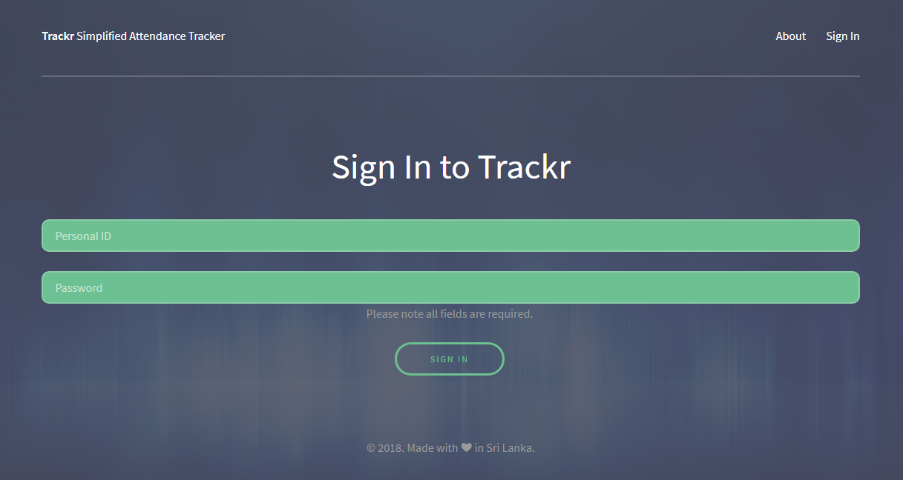
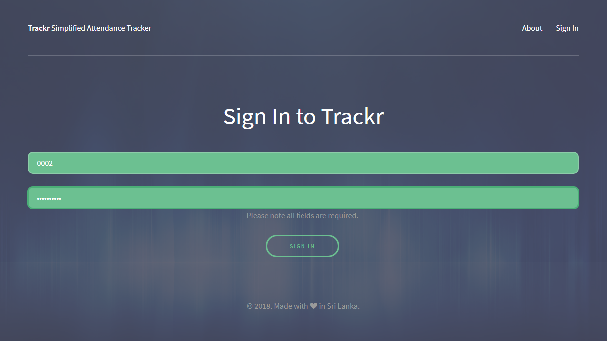

# Trackr
## Attendance Tracking System with geolocation information

Java Dynamic Web Application developed for logging attendant sign-in and sign-out times with geolocation data.
Multiple user accounts may be created for attendants and admins. Sign in with an admin account to view attendee activities.

#### 'Sign In' page

#### 'Signed In' page

